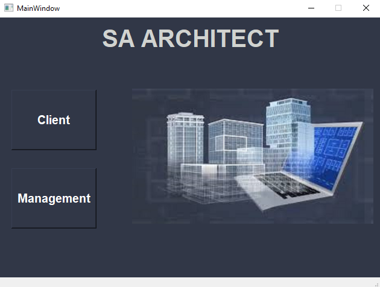
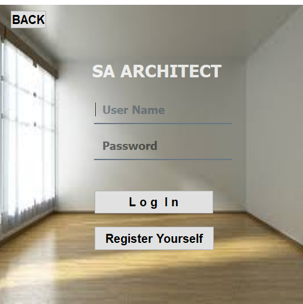
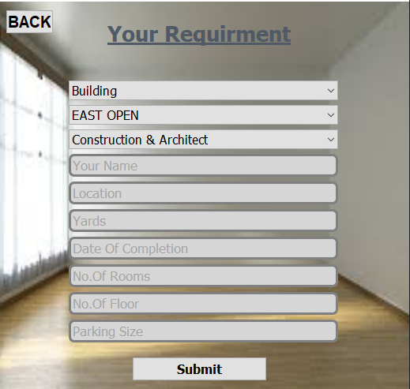
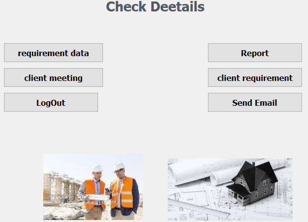
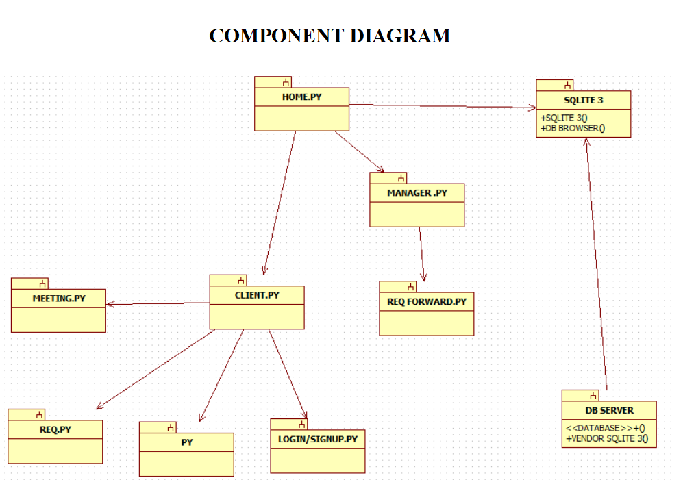
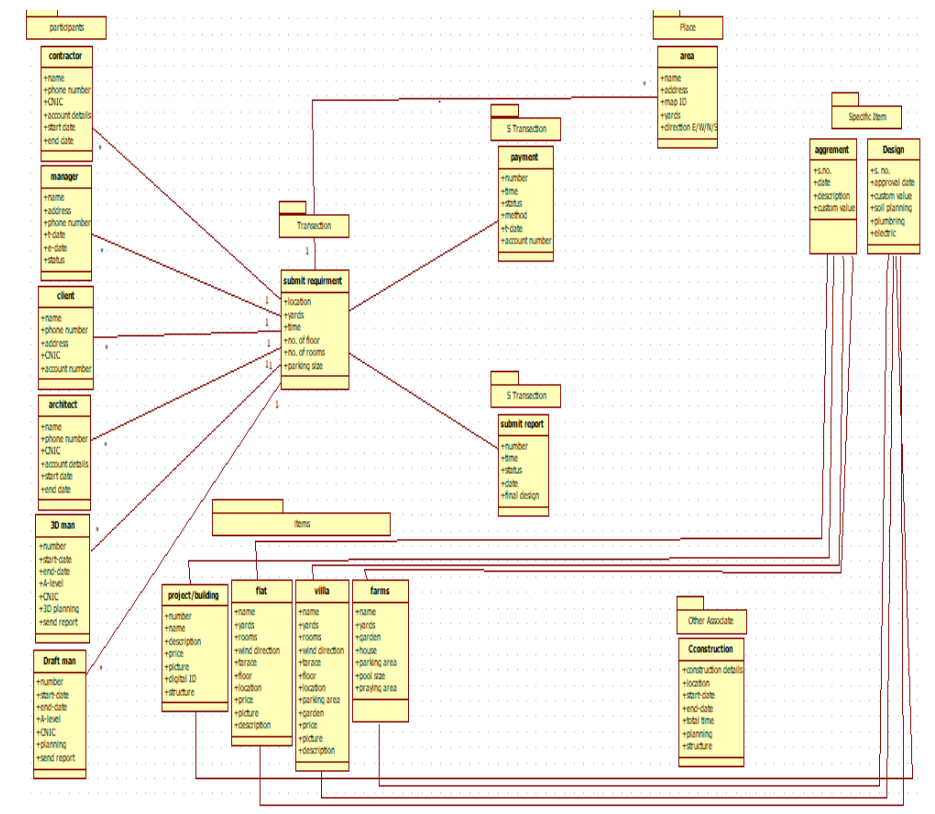

# SA Architect Construction Company

Welcome to the SA Architect Construction Company Management System! This system is designed to streamline and enhance the management of construction projects, clients, and company operations.

## Table of Contents

- [Introduction](#introduction)
- [Features](#features)
- [Usage](#usage)
- [Screenshots](#screenshots)
- [Contributing](#contributing)
- [Contact](#contact)

## Introductio

SA Architect Construction Company Management System is a comprehensive solution for managing construction projects and company operations. The system provides tools for managing clients, projects, employees, and other aspects of the construction business, ensuring efficient and effective operations.

## Features

- **Client Management**: Track and manage client information and interactions.
- **Project Management**: Monitor project progress, deadlines, and resources.
- **Employee Management**: Manage employee details, roles, and responsibilities.
- **Task Assignment**: Assign tasks to employees and track their completion status.
- **Reports and Analytics**: Generate reports and analyze project performance and company metrics.
- **User-friendly Interface**: Intuitive and easy-to-use interface designed for efficiency.


## Usage

To use the SA Architect Construction Company Management System, follow these steps:

1. **Clone the Repository**:
    ```sh
    git clone https://github.com/syedowaisalishah/Construction-Compony-Management-System.git
    cd Construction-Compony-Management-System
    ```

2. **Install Python and PyQt5**:
    - Ensure Python 3.7+ is installed. You can download it from [here](https://www.python.org/downloads/).
    - Install PyQt5 using pip:
        ```sh
        pip install pyqt5
        ```

3. **Install DB Browser for SQLite**:
    - Download and install DB Browser for SQLite from [here](https://sqlitebrowser.org/).

4. **Change Image Path**:
    - Open the `first1.py` file or any other relevant file where image paths are set.
    - Update the image paths to the correct location on your local machine. For example, if your images are located in a folder named `images` within the project directory, you might update the path like this:
        ```python
        self.label.setStyleSheet("border-image: url(images/image1.jpeg);")
        ```

5. **Run the Application**:
    ```sh
    python first1.py
    ```

6. **Using the Application**:
    - **Client Management**: Use the interface to add, edit, and delete client information.
    - **Project Management**: Create new projects, update existing ones, and monitor progress.
    - **Employee Management**: Add, edit, and manage employee details.
    - **Task Assignment**: Assign tasks to employees and track their status.
    - **Generate Reports**: Create and view reports on various aspects of the business.

By following these steps, you will be able to set up and use the SA Architect Construction Company Management System on your local machine.


## Screenshots

Here are some screenshots of the application:

### Home Screen


### Client Login Page


### Requirement Page


### Dashboard


### Component Diagram


### Object Diagram


## Contributing

Contributions are what make the open source community such an amazing place to be learn, inspire, and create. Any contributions you make are **greatly appreciated**.

1. **Fork the Project**: Fork the repository by clicking the 'Fork' button on the top right corner of the repository page.
2. **Clone the Repository**: Clone the forked repository to your local machine. Open a terminal and run the following command:
    ```sh
    git clone https://github.com/your-username/Construction-Compony-Management-System.git
    ```
3. **Update Frontend Page**: Make necessary changes or improvements to the frontend pages, such as UI enhancements or new features.
4. **Update README**: If you've made significant changes or added new features, update the README file to reflect those changes. Follow the existing format and guidelines.
5. **Commit Changes**: Commit your changes with a descriptive commit message explaining the improvements or additions you've made.
    ```sh
    git add .
    git commit -m 'Add feature: [brief description of feature]'
    ```
6. **Push Changes**: Push your changes to your forked repository.
    ```sh
    git push origin main
    ```
7. **Create Pull Request**: Go to the original repository and click on the 'New Pull Request' button. Provide a brief description of your changes and submit the pull request.

Your contributions will be reviewed and merged to the main branch if they meet the project's guidelines and standards. Thank you for your contribution!

## Contact

For any inquiries or suggestions, feel free to reach out:

- **Email**: [alishahowais@gmail.com](mailto:alishahowais@gmail.com)
- **LinkedIn**: [Syed Owais Ali Shah](https://pk.linkedin.com/in/syed-owais-ali-shah-945707247?trk=people-guest_people_search-card)
- **GitHub**: [syedowaisalishah](https://github.com/syedowaisalishah)

- **Email**: [sohaibofficial25@gmail.com](mailto:sohaibofficial25@gmail.com)
- **LinkedIn**: [MuhammadSohaibRashid](https://www.linkedin.com/in/muhammad-sohaib-rashid/)
- **GitHub**: [MuhammadSohaibRashid](https://github.com/MuhammadSohaibRashid)


### Prerequisites

- [Python 3.7+](https://www.python.org/downloads/)
- [PyQt5](https://pypi.org/project/PyQt5/)
- [sqlitebrowser](https://sqlitebrowser.org/)
- [Git Clone Repository](https://github.com/syedowaisalishah/Construction-Compony-Management-System.git)

### Clone the Repository

```sh
git clone https://github.com/syedowaisalishah/Construction-Compony-Management-System.git
cd Construction-Compony-Management-System
